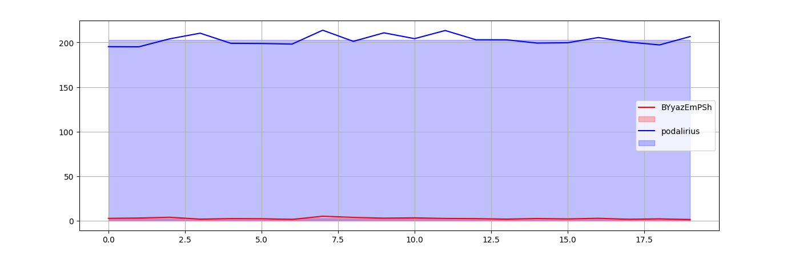
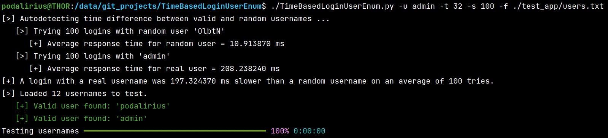

# TimeBasedLoginUserEnum

<p align="center">
  A script to enumerate valid usernames based on the requests response times.
  <br>
  
  <a href="https://twitter.com/intent/follow?screen_name=podalirius_" title="Follow"></a>
  <a href="https://www.youtube.com/channel/Podalirius_?sub_confirmation=1" title="Subscribe"></a>
  <br>
</p>

## Features

**Requirement**: A valid username on the application (no need for password)

 - [TimeBasedLoginAnalysis.py](./TimeBasedLoginAnalysis.py)
   + [x] Analysis of the response time differences between a valid and invalid username.
   + [x] Plot analysis results to a graph (option `-S` of ) or export to file (option `-f <graph.png>`).
   + [x] Multithreaded login tries.
 
 - [TimeBasedLoginUserEnum.py](./TimeBasedLoginUserEnum.py)
   + [x] Extract only usernames returning responses times that stands out.
   + [x] Multithreaded login tries.
   
## Usage

```
$ ./TimeBasedLoginUserEnum.py -h
usage: TimeBasedLoginUserEnum.py [-h] -u USERNAME -f USERNAMES_FILE [-t THREADS] [-s SAMPLES] [-v]

Enumerate valid usernames based on the requests response times.

optional arguments:
  -h, --help            show this help message and exit
  -u USERNAME, --username USERNAME
                        Username
  -f USERNAMES_FILE, --usernames-file USERNAMES_FILE
                        List of usernames to test
  -t THREADS, --threads THREADS
                        Number of threads (default: 4)
  -s SAMPLES, --samples SAMPLES
                        Number of login tries (default: 20)
  -v, --verbose         Verbose mode. (default: False)

```

## Demonstration

You can test this tool with the Flask app in [app.py](./test_app/app.py) and the wordlist [users.txt](./test_app/users.txt). 

**Step 1: Analysis of time differences between valid and invalid usernames**

First step is to analyze whether there is a time based leak of information on the login tries:

```
./TimeBasedLoginAnalysis.py -u podalirius -S
```



**Step 2: Enumerate usernames based on response times**

Now that we know that there is a time based leak of information, we can enumerate users with this command:

```
./TimeBasedLoginUserEnum.py -u admin -t 32 -s 100 -f ./test_app/users.txt
```



## Contributing

Pull requests are welcome. Feel free to open an issue if you want to add other features.
